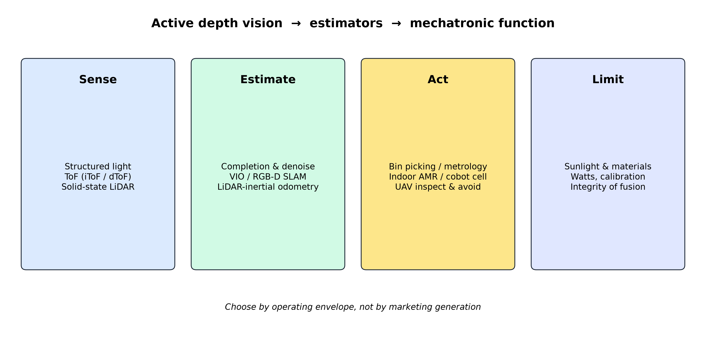
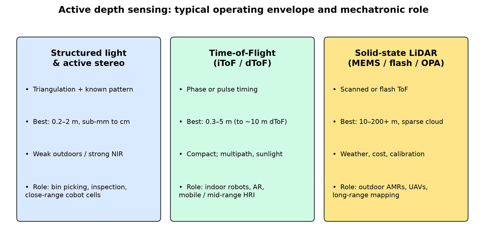
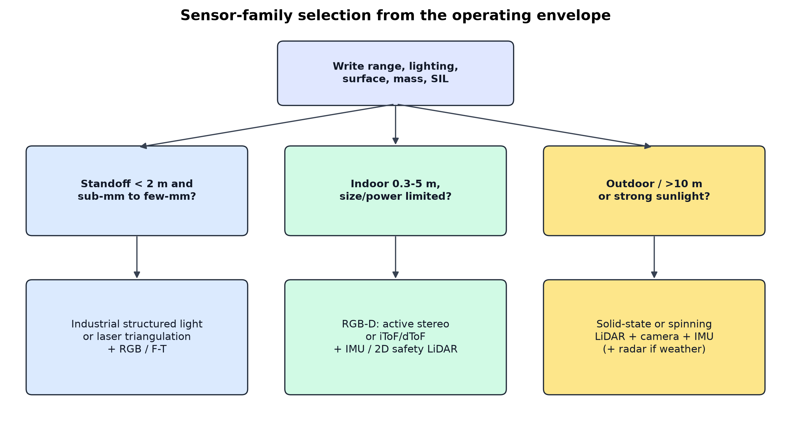
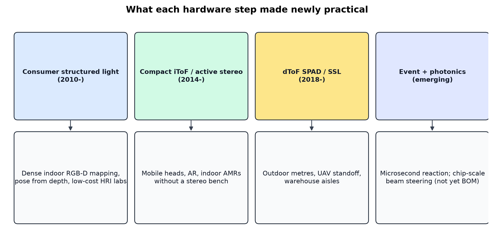
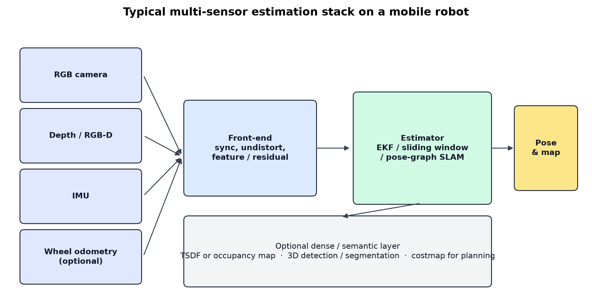
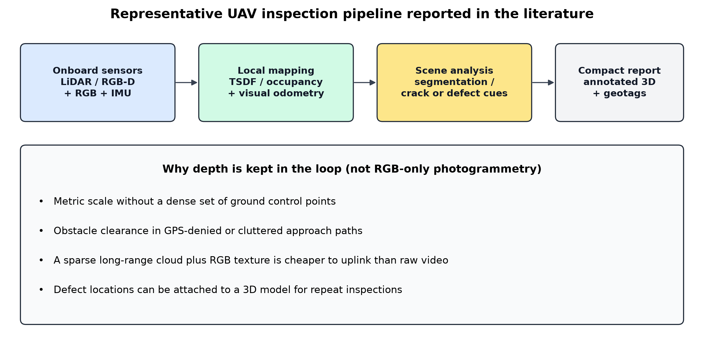

# Depth Vision Sensors: Technological Evolution, Enabling Algorithms, and Applications in Mechatronic Systems

Bo Zhang1,2 | Hongchao Cui1,2

1 School of Mechanical, Electronic and Control Engineering, Beijing Jiaotong University, Beijing, China
2 Beijing Key Laboratory of Flow and Heat Transfer of Phase Changing in Micro and Small Scale, Beijing Jiaotong University, Beijing, China

**Corresponding author: Hongchao Cui (hccui@bjtu.edu.cn)**

## Abstract

Background: Active depth cameras and solid-state LiDAR now sit on industrial robots, indoor mobile bases, and small unmanned aerial vehicles (UAVs), yet designers still treat “depth sensor” as one specification. Methods: This structured narrative review screens English-language work from 2001 to early 2025 in IEEE Xplore, Scopus, and Web of Science on structured light, time-of-flight (ToF), RGB-D, solid-state LiDAR, depth completion, visual-inertial and RGB-D SLAM, bin picking, collaborative robots, and UAV ranging. Priority is given to hardware papers, comparative evaluations with reported error, and application studies that name the modality. Results: Structured light still owns close-range accuracy; compact iToF and active stereo own room-scale mobile heads; solid-state LiDAR owns outdoor metres. Those envelopes, not marketing generations, decide whether KinectFusion-style mapping, visual-inertial-depth odometry, LiDAR-inertial odometry, or a safety-rated stop is even feasible. Conclusions: A mechatronic stack should be chosen by range, lighting, surface, mass, and safety integrity, keep a metric low-level range channel when a motor can stop, and treat calibration as a first-class design item. The paper maps sensor physics to estimators and applications; it does not replace modality-specific optics surveys.

Keywords: depth vision sensors; mechatronic systems; structured light; time-of-flight; solid-state LiDAR; RGB-D; SLAM; sensor fusion; collaborative robots; UAV inspection

## Highlights

• Hardware generations did not replace one another. They split the operating envelope: structured light for close-range accuracy, ToF and active stereo for compact room-scale sensing, solid-state LiDAR for outdoor metres.

• Comparative evaluations (Kinect v1/v2, Azure Kinect, RealSense D400-class, multi-camera indoor tests) give order-of-magnitude errors that are usable for system design if they are not treated as datasheet guarantees.

• The estimator must match the front-end: TSDF fusion for tabletops, visual-inertial-depth odometry for indoor bases, LiDAR-inertial odometry for sparse long-range clouds.

• A consumer RGB-D camera is not a safety-rated device. Collaborative cells still need ISO/TS 15066 logic, a safety controller, and usually a redundant channel.

• Event cameras, on-sensor AI, and photonic beam steering are real research directions. They are not yet drop-in replacements for frame-based RGB-D in a warehouse bill of materials.

*Graphical abstract. Active depth families feed distinct estimators and only then become mechatronic functions. Limits (sunlight, watts, calibration, fusion integrity) remain first-order.*

## 1. Introduction

Autonomous mobile robots, flexible manufacturing cells, and small UAVs all require a timely geometric model of the workspace [1,2,3,4]. Among perception options, vision remains attractive because it is non-contact, relatively inexpensive, and information-dense. Two-dimensional cameras supply appearance. Depth vision adds metric range, which simplifies obstacle clearance, grasp planning, and map scale. In a mechatronic system that coupling is not cosmetic: the same millimetre that is harmless in a visualization can be the difference between a successful insertion and a jammed assembly, or between a UAV standoff and a girder strike.

This review is restricted to active depth vision: sensors that illuminate the scene with a controlled optical source and recover three-dimensional geometry from the returned light. The main families are structured light and active stereo, continuous-wave and pulsed ToF cameras, and solid-state LiDAR [5,6,7,8,9,10]. We contrast them with passive stereo and learning-based monocular depth, which rely on ambient texture or data-driven priors [11,12,13]. Passive methods have improved rapidly, but active sensors remain the default in many deployed mechatronic systems because they provide dense or semi-dense metric depth on weakly textured surfaces and under changing indoor lighting [4,14,15].

The 2010 Microsoft Kinect showed that dense indoor depth could be obtained at consumer cost [14,16]. That device, and the algorithms built on it, moved RGB-D mapping and human pose estimation out of specialized laboratories [17,18,19]. Subsequent products reduced size and power (mobile ToF and active-stereo modules) and then extended range (solid-state LiDAR), which changed the set of machines that could carry a depth sensor [9,10,20,21].

Several surveys already cover pieces of this landscape (Table 1). Lock-in ToF cameras [7], ToF range imaging more broadly [8,22,23], structured-light metrology [5,6], comparative RGB-D tests [4,24], visual SLAM [1,25,26,27], event cameras [28], and LiDAR hardware [9,10,29,30] are all better treated in those sources than they can be in one paper. What is still useful, and what this paper attempts, is not another first-principles optics tutorial. It is a system-level map that answers a design question: which physical generation of depth sensor made which mechatronic function practical, and which residual errors still dominate in the field.

*Table 1. Closest prior surveys and the slice added here. This paper is complementary, not a replacement.*

| Prior survey | Main focus | What a mechatronic designer still has to assemble |
| --- | --- | --- |
| Foix et al.; Horaud et al. [7,8] | ToF camera physics and calibration | How iToF/dToF sit next to SL and LiDAR on a robot |
| Zhang; Geng [5,6] | Structured-light metrology | When a fringe scanner is the wrong robot sensor |
| Halmetschlager-Funek et al. [4] | Empirical RGB-D ranking | Estimator and application consequences |
| Cadena et al.; later V-SLAM surveys [1,26] | SLAM algorithms | Which depth front-end the estimator assumes |
| Ho et al.; Roriz et al. [9,10] | Solid-state / automotive LiDAR | Indoor RGB-D and factory cells |
| Gallego et al. [28] | Event cameras | When event depth is worth the stack change |

### 1.1 Scope and review method

The paper is a structured narrative review. It is not a PRISMA systematic review and does not claim an exhaustive count of every RGB-D paper since 2010. Inventing a flow-diagram numerator would be dishonest. What we did specify is the search frame, the inclusion rule, and the reason a paper was kept.

Sources. English-language records from approximately January 2001 to March 2025 were screened in IEEE Xplore, Scopus, and Web of Science, with publisher sites (IEEE, Springer, Elsevier, MDPI, Wiley, ACM) used to retrieve full texts. Core books and standards were added by citation chasing [23,24,31,32,33,34]. Query stems included structured light, fringe projection, time-of-flight camera, RGB-D, Kinect, RealSense, Azure Kinect, solid-state LiDAR, optical phased array, depth completion, visual-inertial odometry, RGB-D SLAM, LiDAR-inertial odometry, bin picking, 6-DoF pose, collaborative robot, speed and separation monitoring, and UAV obstacle avoidance OR inspection. Boolean combinations were adapted to each database.

Inclusion. A record was kept if it (i) states a depth or ranging principle that a mechatronic designer can act on, (ii) reports a quantitative error, range, or system result, or (iii) is a widely cited survey that we needed in order to point readers to a deeper treatment. Exclusion. Purely biomedical or cinematic uses; papers that never name the depth modality; product blogs and unreviewed datasheets as primary evidence; and mechanical spinning LiDAR except as a baseline for solid-state designs. When two papers report the same device, the peer-reviewed metrology study is preferred over a manufacturer white paper. Table 1a records that rule.

*Table 1a. Inclusion and exclusion used in this structured narrative review.*

| Keep if | Drop if | How the record is used |
| --- | --- | --- |
| Hardware principle or calibration is stated | Modality never named | Section 2 envelopes |
| Peer-reviewed range or error numbers | Datasheet-only claim with no method | Tables 2-3 |
| Estimator assumes a stated depth front-end | Algorithm paper with a generic “depth input” | Section 3 |
| Application names the sensor family | Market survey without a sensing requirement | Section 4 |
| Standard that governs safety or robots | Opinion piece | Sections 4.4 and 5 |

This protocol is enough for a Sensors-style review to be reproducible in spirit. It is not enough to support a meta-analysis of depth RMSE across all consumer cameras, because experimental setups are not commensurate [4,24,35,36]. Non-English records and manufacturer white papers were not treated as primary evidence. The search was last refreshed in March 2025; later product SKUs are therefore outside the evidence window.

### 1.2 Contributions and organization

The paper makes six contributions aimed at mechatronic designers rather than at optics specialists. First, it compares structured light, active stereo, iToF, dToF, and solid-state LiDAR by principle, reported range and error, and role. Second, it compiles device-level numbers from peer-reviewed evaluations of Kinect-class, RealSense-class, and Azure Kinect cameras so that Table 3 can be opened during a design review [14,15,35,36,37]. Third, it links raw artifacts to the estimators that machines actually run, including LiDAR-inertial and lidar-visual-inertial odometry for sparse long-range clouds [38,39,40,41]. Fourth, it organizes applications by the depth property that is spent. Fifth, it states what standard benchmarks measure and what they do not (Table 8). Sixth, it gives an explicit selection flowchart and a checklist that can be copied into a requirements document. Section 2 reviews hardware. Section 3 reviews enabling algorithms. Section 4 reviews applications and selection. Section 5 discusses open problems. Section 6 concludes.

## 2. Technological evolution of depth vision sensors

A useful first cut is the operating envelope: the combination of range, spatial resolution, ambient-light tolerance, size, and cost that a machine can actually use. Figure 1 summarizes the three families that dominate current mechatronic designs.

*Figure 1. Typical operating envelopes of structured light / active stereo, ToF cameras, and solid-state LiDAR, together with the mechatronic roles that follow from those envelopes. Bounds are qualitative summaries of the literature in Table 2, not guarantees for a particular device.*

### 2.1 Structured light and active stereo

Structured-light sensors project a known pattern (dots, stripes, or time-varying fringes) and recover depth by triangulation between the projector and one or more cameras [5,6,42]. If f is the focal length, B the baseline, and d the observed disparity, the pinhole relation is Z = fB/d. Error in disparity therefore grows into a range error that increases approximately with Z squared [14]. Pattern choice is itself a design variable: Salvi et al. classify time-multiplexed, neighbourhood, and direct-coding families, and show that no single code is optimal for both static metrology and a moving robot [42]. Industrial systems usually prefer sequential Gray-code plus phase-shifting fringes because the absolute unwrapping is robust and the phase gives sub-pixel disparity [5,6,43]. Absolute-phase reviews make the same point in more optical detail: the unwrapping step, not the projector brightness, is usually what fails first on discontinuities [43]. Fourier-transform profilometry trades some robustness for a single-shot capture, which matters on moving parts [44]. Industrial fringe-projection systems exploit this geometry at short range and can reach tens of micrometres to sub-millimetre accuracy on cooperative surfaces [5]. The price of that accuracy is a controlled standoff, a cooperative (or at least non-specular) surface, and a workspace that fits the calibrated volume.

Consumer devices traded metrology-grade projectors for a static pseudo-random speckle and on-chip matching. Kinect v1 is the canonical example: a near-infrared (NIR) projector, an infrared camera, and a colour camera. Khoshelham and Elberink showed that its random depth error grows from a few millimetres near the sensor to about 4 cm near 5 m, while axial point spacing can reach about 7 cm at that range [14]. Early geometric studies of the same device reached the same qualitative conclusion and supplied calibration recipes that robotics groups still reuse [45,46]. Those numbers explain both the success of KinectFusion-style indoor reconstruction [17,18] and the unsuitability of the same sensor as an outdoor navigation camera.

Active stereo keeps triangulation but replaces a coded single-camera pattern with a stereo pair plus a texture projector. Intel RealSense R200/D400-class cameras follow this route [20]. Because matching runs on two infrared images, the system can still return depth when the projector is weak or switched off, which improves outdoor behaviour relative to first-generation speckle sensors [4,20]. The cost is compute for stereo matching and a stronger dependence on calibration [11,20]. Indoor tests across structured-light, active-stereo, and ToF units confirm that no single consumer camera dominates bias, precision, lateral noise, lighting, and multi-sensor interference at once [4,24].

### 2.2 Time-of-flight cameras and mobile miniaturization

A ToF pixel estimates range from the travel time of light. Indirect ToF (iToF; lock-in or continuous-wave) measures the phase shift of a modulated source [7,32,47]. For a modulation frequency f_m the unambiguous range is on the order of c/(2 f_m); a typical 30 MHz tone wraps near 5 m, which is why multi-frequency operation appears on industrial iToF cameras [7,8,32]. Direct ToF (dToF) timestamps a short pulse, often with single-photon avalanche diode (SPAD) arrays and time-to-digital converters [8,21,48]. iToF became practical in compact cameras because a single illuminator and a single sensor replace a precision stereo baseline [7,15]. Reported indoor working distances for consumer iToF, including Kinect v2, are typically 0.5-4.5 m [15,49,50]. Side-by-side studies of Kinect v1 and v2 show that the ToF unit reduced some structured-light artifacts (texture dependence, multi-device interference) while introducing others (multipath in corners, flying pixels, wiggling) [15,49,50,51]. Azure Kinect, the later Microsoft ToF camera, reduced random depth noise relative to Kinect v2 in near-FOV modes under about 3 m and improved spatial accuracy beyond about 2.5 m in laser-scanner comparisons, without removing sunlight or multipath as design limits [35,36]. Sunlight, multipath, and flying pixels remain first-order limitations [15,49,52].

The same physics explains the mobile-ToF wave of the 2010s. A phase camera does not need a wide mechanical baseline, so it fits a phone or an embedded robot head. Early mobile iToF modules were lower in spatial resolution than structured light but more convenient at 2-5 m for augmented reality and coarse scene layout [8,21]. dToF SPAD arrays later improved ambient-light rejection and power per unit of range, at the expense of histogram memory and, often, spatial resolution [21]. Gyongy, Dutton, and Henderson review the dToF signal chain and show why on-chip histogram compression, not only detector quantum efficiency, now limits array size [21]. For a mechatronic designer the takeaway is narrower than the semiconductor literature: if the workspace has corners, glass, or two ToF units that can see each other, budget a multipath and interference test before you freeze the SKU [4,15,52]. Coded ToF can recover a time profile rather than a single phase, but the extra illumination and compute rarely fit a battery-powered head [52].

### 2.3 Solid-state LiDAR and the long-range shift

Once the task leaves the room (warehouse aisles, yards, roads, bridge girders) consumer RGB-D cameras run out of photons and out of unambiguous range. Mechanical spinning LiDAR already solved long-range ranging. Solid-state and semi-solid designs try to keep that range while removing a bulky rotator [9,10,29,30,53,54]. MEMS mirrors scan a laser with a small moving mass and are the most commercially mature semi-solid option. Flash LiDAR illuminates a patch at once and is closer to a ToF camera, with range and resolution set by peak power and pixel count. Optical phased arrays and metasurface beam steerers aim at a fully solid-state scanner [55,56,57,58,59,60]. Large-scale silicon photonic arrays and MEMS-on-photonics demonstrators show that chip-scale beam steering is no longer only a laboratory sketch [57,59]. Circuit- and architecture-level reviews stress that the scanner is only one block: laser, detector, timing, and eye-safety set the range as much as the steering method [53,54]. For mechatronic integration the practical facts are simpler: solid-state units are smaller and potentially more robust to vibration, but they are still sparse compared with RGB-D, still expensive at automotive grade, and still require careful time synchronization with cameras and IMUs [10,29,61]. Automotive surveys also stress eye-safety, rain/fog backscatter, and the need for a perception stack that does not treat a sparse cloud as if it were a Kinect frame [10,29]. A robot or UAV buyer should therefore pick the scanner class by payload and field of view first: MEMS for a compact outdoor head, flash for a short-range patch with no moving parts, and OPA or metasurface units only when the programme can absorb a research-grade integration [9,30,60].

Table 2 collects order-of-magnitude figures reported in the literature. Values are typical envelopes, not guarantees for a particular serial number. Two design rules follow. First, do not treat "depth camera" as one specification: a sensor that is excellent for bin picking is usually the wrong sensor for a 30 m warehouse aisle. Second, hardware generations did not replace one another; they split the operating envelope. Structured light still wins close-range accuracy. ToF wins compactness at room scale. Solid-state LiDAR wins range. Mechatronic architectures increasingly carry more than one of them.

*Table 2. Representative operating envelopes of active depth sensors used in mechatronics. Numbers are typical ranges reported in peer-reviewed evaluations or hardware surveys; product variants differ.*

| Family | Principle | Typical usable range | Reported depth error (order) | Spatial sampling | Main field weakness | Typical role | Sources |
| --- | --- | --- | --- | --- | --- | --- | --- |
| Structured light (consumer) | Static-pattern triangulation | 0.5-4 m | mm near field; ~4 cm random error near 5 m (Kinect v1) | Dense VGA-class | Sunlight; shiny or absorbing surfaces | Indoor mapping, HRI prototypes | [4,14,15] |
| Fringe / industrial SL | Phase-shifting triangulation | 0.1-2 m (setup-dependent) | tens of um to sub-mm | Very dense | Workspace size; ambient light | In-line metrology, bin picking | [5,6] |
| Active stereo | IR stereo + texture projector | 0.2-10 m (best ~0.3-3 m) | cm-level, lighting-dependent | Dense HD-class | Calibration; compute; texture holes | Indoor / semi-outdoor robots | [4,20] |
| iToF camera | CW phase | 0.5-5 m | cm-level; multipath bias | Dense QVGA-VGA | Multipath; sunlight; flying pixels | Mobile robots, mid-range HRI | [7,8,15,49] |
| dToF SPAD | Pulsed photon timing | ~1-10 m consumer; longer if laser-class | cm-level; better ambient rejection than iToF | Often coarser | Histogram memory; pile-up | AR, short-range robots | [21,48] |
| Solid-state / MEMS LiDAR | Scanned or flash ToF | 10-200+ m | few cm (range- and target-dependent) | Sparse points | Cost; weather; boresight | Outdoor AMR, UAV, vehicle | [9,10,29] |

A practical selection sequence used in many robot shops is: write down the minimum and maximum range, the worst lighting, the worst surface, the allowed mass and watts, and the safety integrity level. Only then open a catalogue (Figure 2). Indoor rooms with matte walls still suit RGB-D [4,14,20]. Fixed cells with metal parts still suit industrial structured light [5]. Yards and roads still suit LiDAR, usually fused with cameras [10,61,62]. If two of those worlds appear on one machine, budget two sensors and a calibration procedure, not a single "universal" depth camera.

*Figure 2. Selection from the operating envelope. The three exit boxes are families, not product SKUs. Mixed worlds require mixed sensors.*

Three short examples make the same point. A bin-picking cell with a 1.2 m standoff and oily steel parts should start from industrial structured light, a 6-DoF pose estimator, and a compliant grasp, not from a 100 m LiDAR [5,63,64]. An indoor delivery base that must see a pallet toe and a person in a corridor should start from a wide RGB-D camera plus a two-dimensional safety LiDAR and a visual-inertial estimator [20,65,66]. A bridge-inspection UAV that must hold a 5-15 m standoff in wind should start from a lightweight solid-state ranger, an IMU, and a compact RGB inspector, and should not expect a phone-class ToF module to carry the ranging load [2,9,67].

### 2.4 Device-level numbers and the function each generation unlocked

Family envelopes are not enough when a buyer has to choose a SKU. Table 3 lists numbers that peer-reviewed evaluations actually measured, not marketing ranges. Kinect v1 remains the best-documented structured-light consumer camera [14,45]. Kinect v2 and Azure Kinect document the ToF path, including the fact that Azure Kinect is not uniformly better than v2 at every distance and FOV mode [15,35,36,51]. RealSense SR300 and D415 document the coded-light and active-stereo Intel line with metrological characterizations rather than blog tests [20,37,68]. Halmetschlager-Funek et al. remain the widest indoor multi-device comparison and should be read before any single-camera ranking is trusted [4].

*Table 3. Device-level figures taken from peer-reviewed evaluations. These are experimental orders of magnitude, not acceptance specifications.*

| Device (study) | Principle | Reported range or setup | Reported error / noise | Note for designers |
| --- | --- | --- | --- | --- |
| Kinect v1 [14] | Structured light | Indoor, to ~5 m | Random error few mm near field; ~4 cm near 5 m; axial spacing ~7 cm at 5 m | Good enough for indoor TSDF; not a survey instrument |
| Kinect v2 [15,49,51] | iToF | Typically 0.5-4.5 m indoor | Better texture robustness than v1; multipath, flying pixels, wiggling | Indoor robot head; model the bias [65] |
| Azure Kinect [35,36] | iToF | Mode-dependent; studies cover ~0.5-5 m | NFOV noise ~2x smaller than v2 under 3 m; better than v2 beyond ~2.5 m in one laser-scanner test | Check FOV mode; not a sunlight camera |
| RealSense SR300 [68] | Coded light | Short-range desktop | Metrological characterization; close-range only | Do not stretch to navigation |
| RealSense D415 [37] | Active stereo | Desktop / robot cell distances in the study | cm-level, setup-dependent | Calibration and lighting dominate |
| RealSense D400 family [20] | Active stereo | Roughly 0.2-10 m; best nearer | Matching artefacts if texture and projector are both weak | Outdoor-capable relative to speckle SL |
| Ten-camera indoor test [4] | SL / stereo / ToF mix | Robot-cell indoor grid | No single winner on bias, precision, lighting, multi-device | Re-rank after your lighting and material |

Figure 3 states the causal claim of this review in one picture: each hardware step unlocked a function that was previously impractical at that size and cost. It did not make the previous function obsolete.

*Figure 3. Hardware steps and the mechatronic functions they made newly practical. Emerging event and photonic devices are shown as research, not as current bill-of-materials items.*

## 3. Enabling technologies: from raw depth to a state estimate

Raw depth is not a pose, a mesh, or a grasp. This section reviews the software layers that mechatronic systems insert between the sensor and the controller.

### 3.1 Depth data processing and enhancement

Consumer and automotive depth images share a small set of artifacts: impulse noise, invalid pixels (holes) on occlusions, black or specular surfaces, flying pixels on depth edges, and ToF multipath [4,7,15]. Classical spatial median filters and temporal averaging remain the first firmware line of defence. When a registered RGB image is available, joint bilateral or guided filtering uses colour edges to protect object boundaries while smoothing planar interiors [69]. These filters are cheap enough for embedded GPUs. They do not invent missing geometry.

Depth completion does. Early methods inpainted by diffusion or multi-view geometry. Learning-based completion trained on RGB-D or RGB-plus-sparse-LiDAR pairs now dominates the literature [12,13,70,71,72,73,74,75,76,77,78]. Eigen et al. showed that a multi-scale network can predict depth from a single RGB image [12]; later residual and self-supervised models reduced the need for dense ground truth [13,71,72]. Indoor work still leans on NYU-Depth v2-style labelled apartments [70], and later on ScanNet- and Matterport-scale reconstructions when a method needs more than a few dozen rooms [79,80]. Zhang and Funkhouser showed that even a single RGB-D frame with holes can be completed if surface normals and occlusion boundaries are used as intermediate cues [75]. Outdoor work leans on KITTI-style projected LiDAR, which is sparse and biased toward the road plane [73,81,82]. For that setting, Uhrig et al. introduced sparsity-invariant convolutions [73], and Ma and Karaman showed that even a few hundred metric samples plus RGB yield a dense metric map [74]. Spatial-propagation networks (CSPN, NLSPN) and DeepLiDAR-style normal guidance then became the standard way to spread those sparse metric seeds [76,77,78]. Later non-local and transformer architectures improve large holes by using long-range context, at a cost that still challenges small onboard computers [83]. A mechatronic reading of these papers is that completion is a good virtual sensor for visualization and mid-level planning, and a bad sole input to a safety-rated stop. KITTI ranks are especially easy to over-read: a method that wins on projected road-plane LiDAR can still invent a thin pole or a glass door that a warehouse AMR must not hit [73,82].

Table 4 rates common artifacts by industrial maturity. The important systems point is that learning-based completion is not yet a drop-in safety sensor: it can look plausible while being metrically wrong on transparent, thin, or never-seen objects.

*Table 4. Common depth artifacts and the maturity of current mitigations.*

| Artifact | Dominant cause | Typical mitigation | Maturity |
| --- | --- | --- | --- |
| Impulse noise | Low SNR, scattering | Median filter; temporal averaging | Mature (on-chip / firmware) |
| Holes / invalid pixels | Occlusion, IR absorption, specularity, out-of-range | RGB-guided completion; multi-view fusion | Emerging for real-time embedded use |
| Flying pixels / motion blur | Finite integration time | Shorter exposure; IMU-aided deblur; event sensing | Mixed: IMU fusion common; event methods still research |
| Multipath (ToF) | Indirect returns in corners and shiny rooms | Multi-frequency modulation; coded ToF; model-based subtraction | Maturing on high-end iToF; still hard on cheap single-frequency units [7,52] |
| Sunlight saturation | Ambient NIR swamping the source | Narrow-band filters; higher peak power; dToF / LiDAR; radar fill-in | Partly solved at LiDAR-class power; unsolved for cheap RGB-D outdoors [4,15] |

### 3.2 Sensor fusion and state estimation

A depth camera alone is a poor navigation sensor: it is biased, partially observed, and asynchronous with the actuators. Fusion with an inertial measurement unit (IMU), wheel odometry, and/or a colour camera is therefore the default architecture on mobile robots and UAVs (Figure 4).

*Figure 4. A typical estimation stack on a mobile robot. Depth is one residual source among several. The optional dense or semantic layer is expensive and is often omitted on large-scale outdoor maps.*

Loose coupling treats each sensor as a black-box pose or twist and fuses them in an extended or unscented Kalman filter. The implementation is modular and cheap; the estimate is statistically suboptimal and cannot correct inner calibration errors [31,84]. Lynen et al. showed that a modular multi-sensor filter is enough to fly a MAV if each sensor is treated as a delayed pose update [84]. Tight coupling, as in keyframe visual-inertial odometry (VIO), jointly optimizes visual residuals and IMU preintegration in a sliding window [85,86,87,88,89,90]. The same idea has a longer visual-odometry lineage: MonoSLAM and PTAM showed that a single camera can track a sparse map in real time; SVO and DSO later made semi-direct and direct monocular odometry fast enough for small platforms [91,92,93,94]. OpenVINS and related platforms made the inertial version reproducible [89,90]. Adding metric depth yields visual-inertial-depth odometry: depth removes the monocular scale-gauge ambiguity and supplies geometric constraints in low-texture rooms where VIO would otherwise drift or fail [1,17,87].

Dense RGB-D fusion, from KinectFusion through ElasticFusion and BundleFusion, maintains a truncated signed distance function (TSDF) or surfel map for close-range interaction [17,95,96]. The volumetric idea is older than Kinect: Curless and Levoy already fused range images into a signed-distance volume [97]. The KinectFusion loop is still the mental model: track the live depth against the model, integrate the new frame into a volume, and raycast a synthetic depth for the next track [17,18]. DTAM showed that a similar dense track can be run from a single moving RGB camera if a photometric cost is optimized on a GPU [98]. ElasticFusion dropped the explicit pose graph in favour of dense deformation; BundleFusion restored global consistency with on-the-fly reintegration [95,96]. Those maps are excellent for a tabletop and expensive for a warehouse. Graph-based SLAM adds loop closures so that local odometry does not accumulate without bound [1,31]. RGB-D SLAM systems and the TUM RGB-D benchmark made this stack reproducible [19,99,100,101]. Kerl et al. showed that a dense photometric+depth residual already works on a CPU-era RGB-D camera if exposure is modelled [101]. Later systems (ORB-SLAM, ORB-SLAM2/3, Kimera) combine sparse or semi-dense tracking with optional metric-semantic mapping and multi-robot extensions [66,102,103,104,105]. ORB-SLAM3 in particular folded visual-inertial and multi-map operation into a library that many robot teams actually run [66]. Direct methods such as LSD-SLAM and DSO showed that photometric residuals can replace or complement sparse features when exposure is well modelled [94,106]. Learned dense trackers such as DROID-SLAM, and neural implicit maps (iMAP, NICE-SLAM, Point-SLAM), raise map fidelity again, at a compute cost that still sits above most embedded robot computers [107,108,109,110].

Outdoors, the front-end is usually LiDAR, not RGB-D. LOAM and LeGO-LOAM established feature-based lidar odometry [38,111]. Tight lidar-inertial systems (FAST-LIO, LIO-SAM, FAST-LIO2) then made solid-state and spinning clouds usable on UAVs and handheld platforms without a separate visual pipeline [39,40,112]. FAST-LIO2 in particular registers raw points into an incremental k-d tree and has been demonstrated on solid-state LiDARs with a small field of view [40]. When texture and structure are both available, lidar-visual-inertial estimators (V-LOAM, LVI-SAM, R3LIVE) colour the same map and survive brief LiDAR or camera dropouts better than a single-modality filter [41,61,113,114]. Fusion surveys document the complementary pair: cameras for semantics and texture, LiDAR for metric structure and lighting invariance [61,62].

Point-cloud infrastructure (PCL, iterative closest point, OctoMap, Voxblox) determines whether these estimators can run online on a real chassis [115,116,117,118]. ICP itself has a large variant tree: point-to-plane and generalized-ICP improve robustness on structured rooms, and comparative tests show that the variant, the sampling, and the outlier rule matter as much as the textbook algorithm name [119,120,121]. For control engineers the interface that matters is usually a pose with covariance plus a costmap, not a research SLAM paper. Table 5 compares the fusion patterns that those libraries usually sit under.

*Table 5. Fusion patterns used in mechatronic state estimation.*

| Pattern | Typical inputs | Estimator | Output | Fits | Main cost |
| --- | --- | --- | --- | --- | --- |
| Loose coupling | Depth pose, IMU, wheels | EKF / UKF | 6-DoF pose | Structured indoor bases | Easy, less accurate |
| Tight VIO / VIDO | RGB, IMU, depth | Sliding-window BA | Pose + sparse map | Drones, AR, agile bases | Calibration and CPU |
| Dense RGB-D | Depth + RGB | TSDF / surfels | Mesh or volume | Manipulation, inspection | Memory and scale |
| Pose-graph SLAM | Any odometry + loops | Graph optimization | Globally consistent map | Buildings, multi-floor | Place recognition |
| Visual-LiDAR | Camera + LiDAR + IMU | Tight or loosely fused SLAM | Large-scale metric map | Outdoor AMR / UAV | Sync and extrinsics [61,113] |
| LiDAR-inertial | LiDAR + IMU | iEKF or factor graph | Pose + sparse map | UAV, handheld SSL | Needs a structured cloud [39,40,112] |
| Lidar-visual-inertial | LiDAR + camera + IMU | Tight factor graph | Coloured metric map | Outdoor inspection | Sync and exposure [41,114] |

### 3.3 From geometry to semantics

Once a metric cloud exists, the next questions are what the object is and where the robot may go. Classical 3D detectors used hand-crafted histograms. Current networks consume raw points, voxels, or range images [83,122,123]. Semantic segmentation labels every point; instance segmentation separates two chairs of the same class. RGB remains useful for texture and class priors; depth remains useful for scale and occlusion. Pose-estimation benchmarks such as BOP and methods such as PoseCNN made 6-DoF object pose a measurable industrial problem rather than a one-off demonstration [124,125].

Beyond labels, mechatronic systems care about affordances: surface normals and curvature for grasp stability, traversable floor versus negative obstacles, and dynamic scene graphs that persist over time [64,104,105]. These layers are not unique to depth sensors, but they become cheaper when scale is observed rather than inferred. In dynamic scenes, geometric SLAM without semantics remains brittle; recent surveys document the shift toward semantic and robust dynamic SLAM [27,126].

### 3.4 Geometric calibration as a first-class subsystem

Every number in Tables 2 and 3 assumes that the depth camera, the colour camera, and any IMU or LiDAR share a known frame. Zhang's planar calibrator is still the colour-camera starting point [127]. RGB-D devices need a joint model of colour intrinsics, depth distortion, and the depth-to-colour extrinsics; Herrera, Kannala, and Heikkila gave the recipe that most robotics stacks still follow [46]. Kinect-era papers already showed that an uncalibrated factory model leaves a systematic bowl in the point cloud [14,45]. On a mobile robot the same error looks like a sloping floor and a biased obstacle range [65]. Visual-inertial and lidar-inertial estimators can absorb a slowly varying extrinsic, but they cannot invent a time stamp that the hardware never sent [40,87,90]. A design review that skips the calibration and synchronization budget is not finished.

### 3.5 Benchmarks and what they do not measure

A Sensors review that only names algorithms without naming the datasets they were scored on is hard to use. Table 8 lists the public suites that most of the papers in Sections 3.1-3.3 actually report. TUM RGB-D and ICL-NUIM made indoor RGB-D odometry comparable [100,128]. EuRoC and TUM VI did the same for visual-inertial estimators on MAVs and handheld sensors [129,130]. KITTI and later driving sets (including nuScenes) dominate outdoor completion and lidar-camera fusion [73,81,82,131]. NYU-Depth, ScanNet, and Matterport3D supply indoor labels for completion and semantics [70,79,80]. YCB and BOP supply objects and 6-DoF pose protocols for grasping cells [124,132].

Two caveats matter more than the leaderboard. First, a good absolute trajectory error on TUM RGB-D or EuRoC does not certify a warehouse aisle or a sunny yard: those sequences are short, mostly well lit, and free of the safety integrity requirement [4,100,129]. Second, completion RMSE on KITTI is a score on projected LiDAR, not a guarantee that thin, transparent, or never-seen objects are recovered [73,82]. A design review should therefore treat Table 8 as a map of where a method was tested, not as a substitute for a factory or flight trial.

*Table 8. Public benchmarks used by the algorithms reviewed here, and the mechatronic question each suite cannot answer.*

| Suite | Typical front-end | What it scores | What it does not score |
| --- | --- | --- | --- |
| TUM RGB-D; ICL-NUIM [100,128] | RGB-D | Indoor ATE / reconstruction | Sunlight, rain, safety integrity |
| EuRoC; TUM VI [129,130] | Mono/stereo + IMU | MAV / handheld VIO drift | Warehouse aisles; ToF multipath |
| KITTI; KITTI depth [73,81,82] | Camera + spinning LiDAR | Driving odometry and completion | Indoor cells; glass and thin poles as safety objects |
| nuScenes [131] | Camera + LiDAR + radar | Multimodal driving perception | Factory lighting; cobot cells |
| NYU; ScanNet; Matterport3D [70,79,80] | RGB-D | Indoor depth and semantics | Metric safety; outdoor range |
| YCB; BOP [124,132] | RGB-D on tabletop objects | 6-DoF pose and grasp datasets | Oily steel bins; line vibration |

## 4. Applications in mechatronic systems

The same sensor physics appears as different requirements once a machine has a job. This section organizes applications by the depth property that is actually spent.

### 4.1 Industrial automation and precision manufacturing

Bin picking and unstructured part handling spend spatial resolution and short-range accuracy. A sensor above the bin produces a point cloud; a pose estimator returns a 6-DoF grasp; a compliant gripper absorbs the residual error [63,64,124,125,133,134,135,136,137]. Grasp-from-point-cloud methods (GPD, Dex-Net, GG-CNN, GraspNet) showed that a depth image plus analytic or learned grasp scores can propose suction or parallel-jaw contacts without a full CAD model of every SKU [64,133,135,136]. When the part identity is known, multi-view pose networks of the Amazon Picking Challenge generation, PoseCNN, DenseFusion, and later estimators scored on BOP turn the same cloud into a 6-DoF object pose [124,125,134,137]. The YCB object set made those scores comparable across laboratories [132]. The first Amazon Picking Challenge made the systems nature of this problem obvious: teams that treated perception, planning, and gripping as separately optimized modules underperformed relative to tightly integrated stacks, and suction often beat anthropomorphic hands [63]. Structured light and laser triangulation still dominate when parts are metallic, overlapping, and closer than about two metres [5,63]. RGB is typically fused for class identity; force and torque close the last millimetres. A designer should therefore budget the sensor for the worst SKU in the bin, not the average YCB object: black rubber and oily steel still empty a consumer RGB-D cloud [4,132].

In-line metrology spends repeatability and speed. A fringe-projection or ToF snapshot is compared with a computer-aided design (CAD) model. Fringe systems own the micrometre-to-sub-millimetre band [5,6]. ToF cameras are used when the assembly is large and a few millimetres of error are acceptable, because a full-field frame arrives without a scanning gantry [7,8]. Vibration of the line is then a fusion problem (encoders and triggers), not only an optics problem.

Automated guided vehicles (AGVs) and autonomous mobile robots (AMRs) spend field of view and vertical coverage. A two-dimensional safety LiDAR sees a plane; a wide RGB-D camera or solid-state LiDAR sees pallets, overhangs, and people who lean into the aisle [4,62,65]. Table 6 summarizes the pairing.

*Table 6. Industrial uses mapped to sensing requirements.*

| Task | Preferred depth family | First-order requirement | Usual extra sensors |
| --- | --- | --- | --- |
| Bin picking | Industrial SL / laser triangulation | Sub-mm to few-mm, high density | RGB; force/torque |
| Assembly guidance | SL or stereo at fixed standoff | Low latency, stable extrinsics | Joint encoders; IMU |
| Full-field inspection | Fringe (precise) or ToF (fast) | Repeatability, line triggering | Conveyor encoder; RGB |
| AMR 3D obstacle sense | Wide RGB-D and/or solid-state LiDAR | Field of view, frame rate, human safety | 2D safety LiDAR; IMU; wheels |

### 4.2 Autonomous mobile robots for service and logistics

Indoor service robots made RGB-D SLAM a product feature. Devices such as RealSense D400-class cameras are chosen because they balance size, power, software support, and indoor range [4,20]. Keselman et al. documented the optical and matching behaviour of the R200 and D400 families, including the fact that projector texture is an aid rather than a requirement [20]. The algorithmic backbone is well documented: RGB-D odometry, loop closure, and a metric map [19,99,100,103]. Fankhauser et al. modelled Kinect v2 specifically as a navigation sensor and showed where its systematic bias matters for terrain [65]. Occupancy and signed-distance maps (OctoMap, Voxblox) then turn that cloud into a costmap a local planner can query [117,118]. The remaining failures are physical. Stairs and negative obstacles (curbs, open shafts) are invisible to a waist-height two-dimensional LiDAR. A forward depth camera can reconstruct them if the near field is valid and the robot is slow enough for the integration time [65]. Outdoor last-metre robots meet sunlight and long range, which is why the same software stack often grows a LiDAR or radar [61,62]. Teams that evaluate only on TUM RGB-D or EuRoC should therefore add a sunlight-and-glass trial before they call the stack warehouse-ready [4,100,129].

Human-aware navigation is a semantic layer on the same geometry. Depth supplies a metric body hull; RGB pose estimators supply intent cues [15,16]. Socially acceptable clearance is then a planner parameter, not a new sensor. Active SLAM surveys discuss how a robot should move to keep that map healthy, which is a planning problem built on the same depth front-end [126].

### 4.3 UAVs and aerial robotics

On a small UAV the payload budget is measured in tens of grams and a few watts [2,138]. That constraint, more than any algorithm, explains why lightweight depth cameras and solid-state LiDARs appear on inspection drones while automotive-grade spinning units do not. System papers on vision-controlled micro aerial vehicles already treated cameras, IMUs, and a metric map as one stack rather than as an optional perception add-on [84,138,139].

Obstacle avoidance is the first use. Depth gives a metric stop distance in GPS-denied corridors, forests, or plant rooms [2,140,141]. Barry, Florence, and Tedrake demonstrated tree avoidance at up to 14 m/s with a pushbroom stereo front-end running at 120 Hz on a small airframe [141]. That result is a reminder that geometric ranging, not a particular branded depth camera, is the requirement; stereo, RGB-D, and LiDAR are interchangeable only after latency, weight, and lighting are checked. Event-camera and event-stereo systems push latency into the microsecond regime for fast approach speeds [28,142,143,144]. Falanga et al. used event cameras to dodge dynamic obstacles that a frame-based pipeline would blur [142]. Miniature platforms have demonstrated onboard depth-based avoidance with tight compute envelopes [140].

Mapping and inspection is the second use. Photogrammetry from RGB already builds impressive models [145,146]. Depth or LiDAR is added when the operator needs metric scale, vegetation penetration, or a flight path that stays a fixed standoff from a girder [67,145,146,147,148]. Bridge work is the most documented civil case: drone-enabled visual inspection procedures exist, and unmanned systems have been used to cue fatigue-crack examination on steel members [147,148]. Quality-assessment studies warn that a pretty mesh is not an inspection: motion blur, standoff, and lighting can hide the crack the flight was commissioned to find [149]. Next-best-view planners show how a ranging front-end can choose the next pose instead of flying a fixed lawnmower [150]. Civil-infrastructure reviews show that the bottleneck is rarely whether a point cloud can be built. It is converting that cloud into defect locations that an engineer will trust [67]. Aerial manipulation is a third, still-research use: a ranging front-end can keep a tool at a commanded standoff, but contact dynamics then dominate the stack [151].

*Figure 5. Representative UAV inspection pipeline assembled from published practice. This figure is a literature synthesis, not a system designed in the present paper.*

Figure 5 describes a representative architecture assembled from published inspection practice, not a system designed in this paper. A bridge-inspection UAV typically carries a long-range ranging sensor (solid-state LiDAR or equivalent), a high-resolution RGB camera, and an IMU [67,145,146]. Onboard software fuses range and inertia into a local metric volume and runs a lightweight network on RGB for component and surface-defect cues [67]. The aircraft uplinks an annotated model and geotagged defect hypotheses rather than raw multi-sensor video. The design is a bandwidth and trust design: inspectors re-photograph the flagged regions instead of watching hours of flight video. Multi-UAV structure-from-motion benefits from the same metric scale cue. Depth does not replace inter-vehicle communication, but it reduces the need for dense ground control [145,146].

### 4.4 Collaborative robots and human-robot interaction

Collaborative cells fail first on safety, then on programming time [3,152,153,154,155]. Depth cameras address both, with limits that must be stated. Broader HRI surveys make the same split: methods that keep a human safe, and methods that make the robot usable [154,155].

Workspace monitoring. A ceiling or cell-side depth sensor builds a three-dimensional occupancy of the shared volume. Speed-and-separation monitoring, as framed by ISO/TS 15066, can then slow or stop the arm when a person enters a warning or protective zone [3,33]. The industrial-robot safety standard ISO 10218 still sits underneath that technical specification [34]. Three-dimensional monitoring is more complete than a light curtain because it can shrink the protective volume as the arm slows and can see a person who leans over a fence. Control papers that quantify collaborative safety treat separation, speed, and a defined protective stop as metrics, not as a camera specification [156]. A consumer RGB-D camera is not automatically a safety-rated device. Certified implementations still need a safety controller, defined failure modes, and usually a redundant sensing channel [3,33,153,155]. Surveys of industrial human-robot collaboration treat safety and the user interface as the two bottlenecks that decide whether a cobot is actually used, not whether a depth demo exists [3,152,154]. Collision detection on the arm itself remains necessary because vision cannot see inside the contact [153].

Programming by demonstration. Tracking a tool or a marked workpiece in 3D lets a non-expert move the robot through a path [3,152]. Structured light at short range is usually sufficient. The hard parts are correspondence, occlusion by the operator, and converting a human demonstration into a collision-free, force-feasible program. Gesture and activity cues can distinguish a small set of commands or detect that a station is ready for the next part [3,16]. This is useful. It is not a substitute for a well-designed hardware enable switch.

### 4.5 A copy-paste selection checklist

The following list is intended to be copied into a requirements document. It is the operational summary of Sections 2-4.

1. Write the minimum and maximum range that must work, not the range that would be nice.

2. Write the worst lighting (sun through a door, welding flash, night) and the worst surface (black rubber, glass, wet steel).

3. Write the mass, volume, and watt budget, including the illuminator.

4. Write the safety integrity: visualization, planner input, or motor-stop. Motor-stop needs a certified channel [33,34].

5. Pick the family from Figure 2. If two worlds appear, budget two sensors.

6. Pick a SKU only after reading a peer-reviewed evaluation of that family, not a datasheet alone [4,35,37].

7. Budget calibration, time synchronization, and a warm-up interval as line items [35,46].

8. Match the estimator to the cloud: TSDF for a table, VIO/VIDO for a room, LIO for a sparse outdoor scan [17,40,66].

9. Keep a raw or lightly filtered metric range path if the output can stop a motor. Do not stop a motor on a completed depth map alone.

10. Re-test on the real surfaces and the real lighting. Indoor rankings reorder outdoors [4].

## 5. Challenges and future perspectives

### 5.1 Persistent deployment problems

The research literature sometimes treats remaining errors as temporary. Fielded mechatronic systems suggest otherwise. Table 7 separates mitigations that already ship from ideas that remain research.

Environment and materials. NIR-based cameras saturate in sunlight [4,15]. Specular and transparent objects violate the single-bounce assumption and produce holes or biased ranges [7,52]. Coded and multi-frequency ToF can unmix some multipath, but they add capture time or hardware that a cheap module does not have [7,52]. Low-reflectance foam and black rubber starve the illuminator. Polarization, multi-frequency ToF, and radar fill-in help; none is universal. Comparative tests of ten indoor depth cameras remain the most useful reminder that material and lighting can reorder the ranking of otherwise similar devices [4].

Compute and power. Dense SLAM, TSDF fusion, and point-cloud networks are still expensive on a battery [1,21,83]. The illuminator, not only the GPU, shortens UAV endurance [2,21]. Event-based and neuromorphic pipelines are promising where the scene is sparse in time [28,142,157], but they require a different software stack.

Calibration and time. Multi-sensor extrinsics drift with temperature and shock. A one-degree boresight error is negligible for a room-scale display and unacceptable for a 50 m LiDAR-camera fusion [10,61]. Online self-calibration exists in research estimators [66,87]; it is not yet a maintenance-free commodity. Asynchronous streams and sensor dropouts can make a naively fused estimate worse than the best single sensor [31,62].

Interfaces and cost. Unlike USB webcams, depth devices still disagree on coordinate frames, distortion models, and confidence channels [4,20]. High-grade solid-state LiDAR remains expensive relative to the rest of a service robot [10]. Standardization would save more engineering time than another incremental denoiser.

*Table 7. Challenges and the honesty level of current mitigations.*

| Domain | Concrete problem | Pathway that already ships | Pathway still in research |
| --- | --- | --- | --- |
| Environment | Sunlight, glass, black parts | dToF/LiDAR, multi-echo, radar | Polarization / hyperspectral ToF |
| Compute | Dense 3D + semantics on-device | NPU for 2D nets; sparse maps | Event + spiking co-design [28,158,159] |
| Integration | Extrinsics, time, dropouts | Factory calibration; hardware sync | Lifelong self-calibration |
| Semantics | Novel clutter, moving people | Closed-set 3D detectors | 3D foundation models, Sim2Real |
| Cost / API | Proprietary frames, high unit cost | ROS drivers; a few de-facto SDKs | Safety-rated, interoperable depth |

### 5.2 Outlook

Event-based and neuromorphic sensing. Asynchronous pixels report contrast changes at microsecond latency and high dynamic range [28,157,160]. Combined with pulsed illumination they can support low-power depth for high-speed robots [142,143,144,161,162]. Automotive work has already shown that event cameras can close a low-latency perception loop that frame cameras miss [163]. Co-design with spiking processors aims to cut the energy of spatial reasoning [158,159]. These systems will complement, not replace, frame-based RGB-D in the next product cycle.

AI near the sensor. Depth completion and a first detection head are moving into image-signal processors and sensor stacks [12,21,74]. The engineering gain is bandwidth: a robot can ship a confidence-weighted cloud or a set of objects instead of a raw 30 Hz volume. The engineering risk is silent metric failure. Safety-related channels should keep a raw or lightly filtered range path.

Richer fusion. Depth-RGB-IMU is already standard. Adding millimetre-wave radar (fog, rain, radial velocity) and thermal cameras is the practical next step, already visible in automotive datasets [62,131]. The unsolved part is a fusion integrity layer: knowing when to stop trusting a modality.

Photonics and materials. Metalenses and other flat optics can shrink camera modules [164]. Chip-scale optical phased arrays and MEMS-on-photonics LiDAR attack the scanner itself [57,58,59,60]. First-photon imaging and non-line-of-sight reconstructions show what is physically possible at extreme photon counts [165,166]. They are not yet bill-of-materials options for a warehouse AMR. Neural radiance fields and 3D Gaussian splatting are changing how a reconstructed scene is stored and rendered [167,168]. For a mechatronic stack they are still map representations, not replacements for a metric range channel that can stop a motor [108,109].

Infrastructure sensing. Ceiling-mounted depth in factories and intelligent spaces can offload onboard mapping. The idea is sound. The obstacles are privacy, networking, and a shared metric frame that every vendor agrees to.

## 6. Conclusion

Depth vision in mechatronics did not evolve as a single replacement chain. Structured light made dense, inexpensive, close-range geometry ordinary. ToF made that geometry small enough for mobile heads and phones. Solid-state LiDAR made long-range ranging compatible with vibration-sensitive platforms. Algorithms (completion, tight-coupled odometry, RGB-D SLAM, and 3D semantics) converted those measurements into poses, maps, grasps, and safety zones.

The remaining limits are mostly physical and organizational: sunlight and materials, watts and memory, calibration, and fragmented interfaces. A next-generation system is unlikely to be one perfect depth camera. It is more likely to be a small set of complementary ranges, an estimator that knows its integrity, and, where possible, a shared map that the machine does not have to rebuild on every shift.

For practitioners, the operational conclusion is conservative. Choose the sensor by operating envelope, not by marketing generation. Budget calibration and lighting as first-class design items. Keep a metric, low-level range channel whenever the output can stop a motor. Treat public benchmarks as a map of where a method was tested, then re-test on the real surfaces, lighting, and safety integrity of the cell or airframe.

## Author contributions

Bo Zhang drafted the review, organized the literature, and prepared the comparative tables and figures. Hongchao Cui conceived the hardware-centered scope, revised the manuscript, and supervised the work. Both authors approved the final version.

## Funding

This review received no specific external funding. The authors will replace this sentence with grant numbers if required by their institution.

## Conflicts of interest

The authors declare no conflict of interest.

## Data availability

No new datasets were generated. All cited sources are listed in the References.

## Acknowledgments

The authors thank colleagues who commented on an earlier draft. Any remaining errors are the authors' own.

## References

[1] Cadena C, Carlone L, Carrillo H, Latif Y, Scaramuzza D, Neira J, Reid I, Leonard JJ. Past, present, and future of simultaneous localization and mapping: Toward the robust-perception age. IEEE Transactions on Robotics. 2016;32(6):1309-1332. doi:10.1109/TRO.2016.2624754

[2] Floreano D, Wood RJ. Science, technology and the future of small autonomous drones. Nature. 2015;521:460-466. doi:10.1038/nature14542

[3] Villani V, Pini F, Leali F, Secchi C. Survey on human-robot collaboration in industrial settings: Safety, intuitive interfaces and applications. Mechatronics. 2018;55:248-266. doi:10.1016/j.mechatronics.2018.02.009

[4] Halmetschlager-Funek G, Suchi M, Kampel M, Vincze M. An empirical evaluation of ten depth cameras: Bias, precision, lateral noise, different lighting conditions and materials, and multiple sensor setups in indoor environments. IEEE Robotics and Automation Magazine. 2019;26(1):67-77. doi:10.1109/MRA.2018.2852795

[5] Zhang S. High-speed 3D shape measurement with structured light methods: A review. Optics and Lasers in Engineering. 2012;50(8):1067-1074. doi:10.1016/j.optlaseng.2012.03.004

[6] Geng J. Structured-light 3D surface imaging: a tutorial. Advances in Optics and Photonics. 2011;3(2):128-160. doi:10.1364/AOP.3.000128

[7] Foix S, Alenya G, Torras C. Lock-in time-of-flight (ToF) cameras: A survey. IEEE Sensors Journal. 2011;11(9):1917-1926. doi:10.1109/JSEN.2010.2101060

[8] Horaud R, Hansard M, Evangelidis G, Menier C. An overview of depth cameras and range scanners based on time-of-flight technologies. Machine Vision and Applications. 2016;27(7):1005-1020. doi:10.1007/s00138-016-0784-4

[9] Ho CP, Li N, Xue J, Lim LW, Chen G, Fu YH, Lee LYT. A progress review on solid-state LiDAR and nanophotonics-based LiDAR sensors. Laser & Photonics Reviews. 2022;16(11):2100511. doi:10.1002/lpor.202100511

[10] Roriz R, Cabral J, Gomes T. Automotive LiDAR technology: A survey. IEEE Transactions on Intelligent Transportation Systems. 2022;23(7):6282-6297. doi:10.1109/TITS.2021.3086804

[11] Scharstein D, Szeliski R. A taxonomy and evaluation of dense two-frame stereo correspondence algorithms. International Journal of Computer Vision. 2002;47(1-3):7-42. doi:10.1023/A:1014573219977

[12] Eigen D, Puhrsch C, Fergus R. Depth map prediction from a single image using a multi-scale deep network. In: Advances in Neural Information Processing Systems 27; 2014. p. 2366-2374.

[13] Godard C, Mac Aodha O, Brostow GJ. Unsupervised monocular depth estimation with left-right consistency. In: Proceedings of the IEEE Conference on Computer Vision and Pattern Recognition (CVPR); 2017. p. 270-279. doi:10.1109/CVPR.2017.699

[14] Khoshelham K, Elberink SO. Accuracy and resolution of Kinect depth data for indoor mapping applications. Sensors. 2012;12(2):1437-1454. doi:10.3390/s120201437

[15] Sarbolandi H, Lefloch D, Kolb A. Kinect range sensing: Structured-light versus Time-of-Flight Kinect. Computer Vision and Image Understanding. 2015;139:1-20. doi:10.1016/j.cviu.2015.05.006

[16] Shotton J, Fitzgibbon A, Cook M, Sharp T, Finocchio M, Moore R, Kipman A, Blake A. Real-time human pose recognition in parts from single depth images. In: Proceedings of the IEEE Conference on Computer Vision and Pattern Recognition (CVPR); 2011. p. 1297-1304. doi:10.1109/CVPR.2011.5995316

[17] Newcombe RA, Izadi S, Hilliges O, Molyneaux D, Kim D, Davison AJ, Kohli P, Shotton J, Hodges S, Fitzgibbon A. KinectFusion: Real-time dense surface mapping and tracking. In: Proceedings of the 10th IEEE International Symposium on Mixed and Augmented Reality (ISMAR); 2011. p. 127-136. doi:10.1109/ISMAR.2011.6092378

[18] Izadi S, Kim D, Hilliges O, Molyneaux D, Newcombe R, Kohli P, Shotton J, Hodges S, Freeman D, Davison A, Fitzgibbon A. KinectFusion: Real-time 3D reconstruction and interaction using a moving depth camera. In: Proceedings of the 24th Annual ACM Symposium on User Interface Software and Technology (UIST); 2011. p. 559-568. doi:10.1145/2047196.2047270

[19] Henry P, Krainin M, Herbst E, Ren X, Fox D. RGB-D mapping: Using Kinect-style depth cameras for dense 3D modeling of indoor environments. The International Journal of Robotics Research. 2012;31(5):647-663. doi:10.1177/0278364911434148

[20] Keselman L, Woodfill JI, Grunnet-Jepsen A, Bhowmik A. Intel RealSense stereoscopic depth cameras. In: IEEE Conference on Computer Vision and Pattern Recognition Workshops (CVPRW); 2017. p. 1267-1276. doi:10.1109/CVPRW.2017.167

[21] Gyongy I, Dutton NAW, Henderson RK. Direct time-of-flight single-photon imaging. IEEE Transactions on Electron Devices. 2022;69(6):2794-2805. doi:10.1109/TED.2021.3131430

[22] Kolb A, Barth E, Koch R, Larsen R. Time-of-flight cameras in computer graphics. Computer Graphics Forum. 2010;29(1):141-159. doi:10.1111/j.1467-8659.2009.01583.x

[23] Zanuttigh P, Marin G, Dal Mutto C, Dominio F, Minto L, Cortelazzo GM. Time-of-Flight and Structured Light Depth Cameras: Technology and Applications. Cham: Springer; 2016. doi:10.1007/978-3-319-30973-6

[24] Giancola S, Valenti M, Sala R. A Survey on 3D Cameras: Metrological Comparison of Time-of-Flight, Structured-Light and Active Stereoscopy Technologies. Cham: Springer; 2018. doi:10.1007/978-3-319-91761-0

[25] Taketomi T, Uchiyama H, Ikeda S. Visual SLAM algorithms: A survey from 2010 to 2016. IPSJ Transactions on Computer Vision and Applications. 2017;9:16. doi:10.1186/s41074-017-0027-2

[26] Macario Barros A, Michel M, Moline Y, Corre G, Carrel F. A comprehensive survey of visual SLAM algorithms. Robotics. 2022;11(1):24. doi:10.3390/robotics11010024

[27] Wang Y, Tian Y, Chen J, Xu K, Ding X. A survey of visual SLAM in dynamic environment: The evolution from geometric to semantic approaches. IEEE Transactions on Instrumentation and Measurement. 2024;73:1-21. doi:10.1109/TIM.2024.3379090

[28] Gallego G, Delbruck T, Orchard G, Bartolozzi C, Taba B, Censi A, Leutenegger S, Davison AJ, Conradt J, Daniilidis K, Scaramuzza D. Event-based vision: A survey. IEEE Transactions on Pattern Analysis and Machine Intelligence. 2022;44(1):154-180. doi:10.1109/TPAMI.2020.3008413

[29] Li Y, Ibanez-Guzman J. Lidar for autonomous driving: The principles, challenges, and trends for automotive lidar and perception systems. IEEE Signal Processing Magazine. 2020;37(4):50-61. doi:10.1109/MSP.2020.2973615

[30] Raj T, Hashim FH, Huddin AB, Ibrahim MF, Hussain A. A survey on LiDAR scanning mechanisms. Electronics. 2020;9(5):741. doi:10.3390/electronics9050741

[31] Thrun S, Burgard W, Fox D. Probabilistic Robotics. Cambridge, MA: MIT Press; 2005.

[32] Hansard M, Lee S, Choi O, Horaud R. Time-of-Flight Cameras: Principles, Methods and Applications. London: Springer; 2013. doi:10.1007/978-1-4471-4658-2

[33] International Organization for Standardization. ISO/TS 15066:2016. Robots and robotic devices - Collaborative robots. Geneva: ISO; 2016.

[34] International Organization for Standardization. ISO 10218-1:2011. Robots and robotic devices - Safety requirements for industrial robots - Part 1: Robots. Geneva: ISO; 2011.

[35] Tolgyessy M, Dekan M, Chovanec L, Hubinsky P. Evaluation of the Azure Kinect and its comparison to Kinect v1 and Kinect v2. Sensors. 2021;21(2):413. doi:10.3390/s21020413

[36] Kurillo G, Hemingway E, Cheng ML, Cheng L. Evaluating the accuracy of the Azure Kinect and Kinect v2. Sensors. 2022;22(7):2469. doi:10.3390/s22072469

[37] Carfagni M, Furferi R, Governi L, Santarelli C, Servi M, Uccheddu F, Volpe Y. Metrological and critical characterization of the Intel D415 stereo depth camera. Sensors. 2019;19(3):489. doi:10.3390/s19030489

[38] Zhang J, Singh S. LOAM: Lidar odometry and mapping in real-time. In: Robotics: Science and Systems; 2014. doi:10.15607/RSS.2014.X.007

[39] Shan T, Englot B, Meyers D, Wang W, Ratti C, Rus D. LIO-SAM: Tightly-coupled lidar inertial odometry via smoothing and mapping. In: IEEE/RSJ International Conference on Intelligent Robots and Systems (IROS); 2020. p. 5135-5142. doi:10.1109/IROS45743.2020.9341176

[40] Xu W, Cai Y, He D, Lin J, Zhang F. FAST-LIO2: Fast direct LiDAR-inertial odometry. IEEE Transactions on Robotics. 2022;38(4):2053-2073. doi:10.1109/TRO.2022.3141876

[41] Shan T, Englot B, Ratti C, Rus D. LVI-SAM: Tightly-coupled lidar-visual-inertial odometry via smoothing and mapping. In: IEEE International Conference on Robotics and Automation (ICRA); 2021. p. 5692-5698. doi:10.1109/ICRA48506.2021.9561996

[42] Salvi J, Fernandez S, Pribanic T, Llado X. A state of the art in structured light patterns for surface profilometry. Pattern Recognition. 2010;43(8):2666-2680. doi:10.1016/j.patcog.2010.01.003

[43] Zhang S. Absolute phase retrieval methods for digital fringe projection profilometry: A review. Optics and Lasers in Engineering. 2018;107:28-37. doi:10.1016/j.optlaseng.2018.03.003

[44] Su X, Chen W. Fourier transform profilometry: a review. Optics and Lasers in Engineering. 2001;35(5):263-284. doi:10.1016/S0143-8166(01)00023-9

[45] Smisek J, Jancosek M, Pajdla T. 3D with Kinect. In: IEEE International Conference on Computer Vision Workshops (ICCVW); 2011. p. 1154-1160. doi:10.1109/ICCVW.2011.6130380

[46] Herrera C D, Kannala J, Heikkila J. Joint depth and color camera calibration with distortion correction. IEEE Transactions on Pattern Analysis and Machine Intelligence. 2012;34(10):2058-2064. doi:10.1109/TPAMI.2012.125

[47] Lange R, Seitz P. Solid-state time-of-flight range camera. IEEE Journal of Quantum Electronics. 2001;37(3):390-397. doi:10.1109/3.910448

[48] Niclass C, Soga M, Kato S, Matsubara H, Kagami M. A 0.18-um CMOS SoC for a 100-m-range 10-frame/s 200 x 96-pixel time-of-flight depth sensor. IEEE Journal of Solid-State Circuits. 2013;48(2):559-572. doi:10.1109/JSSC.2012.2227607

[49] Lachat E, Macher H, Landes T, Grussenmeyer P. Assessment and calibration of a RGB-D camera (Kinect v2 sensor) towards a potential use for close-range 3D modeling. Remote Sensing. 2015;7(10):13070-13097. doi:10.3390/rs71013070

[50] Pagliari D, Pinto L. Calibration of Kinect for Xbox One and comparison between the two generations of Microsoft sensors. Sensors. 2015;15(11):27569-27589. doi:10.3390/s151127569

[51] Wasenmuller O, Stricker D. Comparison of Kinect v1 and v2 depth images in terms of accuracy and precision. In: Computer Vision - ACCV 2016 Workshops. Springer; 2017. p. 34-45. doi:10.1007/978-3-319-54427-4_3

[52] Kadambi A, Whyte R, Bhandari A, Streeter L, Barsi C, Dorrington A, Raskar R. Coded time of flight cameras: sparse deconvolution to address multipath interference and recover time profiles. ACM Transactions on Graphics. 2013;32(6):167. doi:10.1145/2508363.2508428

[53] Royo S, Ballesta-Garcia M. An overview of lidar imaging systems for autonomous vehicles. Applied Sciences. 2019;9(19):4093. doi:10.3390/app9194093

[54] Behroozpour B, Sandborn PAM, Wu MC, Boser BE. Lidar system architectures and circuits. IEEE Communications Magazine. 2017;55(10):135-142. doi:10.1109/MCOM.2017.1700030

[55] Kim I, Martins RJ, Jang J, Badloe T, Khadir S, Jung HY, Kim H, Kim J, Genevet P, Rho J. Nanophotonics for light detection and ranging technology. Nature Nanotechnology. 2021;16:508-524. doi:10.1038/s41565-021-00895-3

[56] Park J, Jeong BG, Kim SI, Lee D, Kim J, Shin C, Lee CB, Otsuka T, Kyoung J, Kim S, Yang KY, Park YY, Lee J, Hwang I, Jang J, Song SH, Brongersma ML, Ha K, Hwang SW, Choo H, Choi BL. All-solid-state spatial light modulator with independent phase and amplitude control for three-dimensional LiDAR applications. Nature Nanotechnology. 2021;16:69-76. doi:10.1038/s41565-020-00787-y

[57] Sun J, Timurdogan E, Yaacobi A, Hosseini ES, Watts MR. Large-scale nanophotonic phased array. Nature. 2013;493:195-199. doi:10.1038/nature11727

[58] Poulton CV, Yaacobi A, Cole DB, Byrd MJ, Raval M, Vermeulen D, Watts MR. Coherent solid-state LIDAR with silicon photonic optical phased arrays. Optics Letters. 2017;42(20):4091-4094. doi:10.1364/OL.42.004091

[59] Zhang X, Kwon K, Henriksson J, Luo J, Wu MC. A large-scale microelectromechanical-systems-based silicon photonic LiDAR. Nature. 2022;603:253-258. doi:10.1038/s41586-022-04415-8

[60] Hsu CP, Li B, Solano-Rivas B, Gohil AR, Chan PH, Moore AD, Donzella V. A review and perspective on optical phased array for automotive LiDAR. IEEE Journal of Selected Topics in Quantum Electronics. 2021;27(1):8300416. doi:10.1109/JSTQE.2020.3022948

[61] Debeunne C, Vivet D. A review of visual-LiDAR fusion based simultaneous localization and mapping. Sensors. 2020;20(7):2068. doi:10.3390/s20072068

[62] Yeong DJ, Velasco-Hernandez G, Barry J, Walsh J. Sensor and sensor fusion technology in autonomous vehicles: A review. Sensors. 2021;21(6):2140. doi:10.3390/s21062140

[63] Correll N, Bekris KE, Berenson D, Brock O, Causo A, Hauser K, Okada K, Rodriguez A, Romano JM, Wurman PR. Analysis and observations from the first Amazon Picking Challenge. IEEE Transactions on Automation Science and Engineering. 2018;15(1):172-188. doi:10.1109/TASE.2016.2600527

[64] ten Pas A, Gualtieri M, Saenko K, Platt R. Grasp pose detection in point clouds. The International Journal of Robotics Research. 2017;36(13-14):1455-1473. doi:10.1177/0278364917735594

[65] Fankhauser P, Bloesch M, Rodriguez D, Kaestner R, Hutter M, Siegwart R. Kinect v2 for mobile robot navigation: Evaluation and modeling. In: International Conference on Advanced Robotics (ICAR); 2015. p. 388-394. doi:10.1109/ICAR.2015.7251485

[66] Campos C, Elvira R, Rodriguez JJG, Montiel JMM, Tardos JD. ORB-SLAM3: An accurate open-source library for visual, visual-inertial, and multimap SLAM. IEEE Transactions on Robotics. 2021;37(6):1874-1890. doi:10.1109/TRO.2021.3075644

[67] Spencer BF Jr, Hoskere V, Narazaki Y. Advances in computer vision-based civil infrastructure inspection and monitoring. Engineering. 2019;5(2):199-222. doi:10.1016/j.eng.2018.11.030

[68] Carfagni M, Furferi R, Governi L, Servi M, Uccheddu F, Volpe Y. On the performance of the Intel SR300 depth camera: metrological and critical characterization. IEEE Sensors Journal. 2017;17(14):4508-4519. doi:10.1109/JSEN.2017.2703829

[69] Kopf J, Cohen MF, Lischinski D, Uyttendaele M. Joint bilateral upsampling. ACM Transactions on Graphics. 2007;26(3):96. doi:10.1145/1276377.1276497

[70] Silberman N, Hoiem D, Kohli P, Fergus R. Indoor segmentation and support inference from RGBD images. In: Computer Vision - ECCV 2012. Springer; 2012. p. 746-760. doi:10.1007/978-3-642-33715-4_54

[71] Laina I, Rupprecht C, Belagiannis V, Tombari F, Navab N. Deeper depth prediction with fully convolutional residual networks. In: International Conference on 3D Vision (3DV); 2016. p. 239-248. doi:10.1109/3DV.2016.32

[72] Godard C, Mac Aodha O, Firman M, Brostow GJ. Digging into self-supervised monocular depth estimation. In: Proceedings of the IEEE/CVF International Conference on Computer Vision (ICCV); 2019. p. 3828-3838. doi:10.1109/ICCV.2019.00393

[73] Uhrig J, Schneider N, Schneider L, Franke U, Brox T, Geiger A. Sparsity invariant CNNs. In: International Conference on 3D Vision (3DV); 2017. p. 11-20. doi:10.1109/3DV.2017.00012

[74] Ma F, Karaman S. Sparse-to-dense: Depth prediction from sparse depth samples and a single image. In: IEEE International Conference on Robotics and Automation (ICRA); 2018. p. 4796-4803. doi:10.1109/ICRA.2018.8460184

[75] Zhang Y, Funkhouser T. Deep depth completion of a single RGB-D image. In: Proceedings of the IEEE Conference on Computer Vision and Pattern Recognition (CVPR); 2018. p. 175-185.

[76] Cheng X, Wang P, Yang R. Depth estimation via affinity learned with convolutional spatial propagation network. In: Proceedings of the IEEE Conference on Computer Vision and Pattern Recognition (CVPR); 2018. p. 5736-5744.

[77] Park J, Joo K, Hu Z, Liu CK, Kweon IS. Non-local spatial propagation network for depth completion. In: Computer Vision - ECCV 2020. Springer; 2020. p. 120-136. doi:10.1007/978-3-030-58601-0_8

[78] Qiu J, Cui Z, Zhang Y, Zhang X, Liu S, Zeng B, Pollefeys M. DeepLiDAR: Deep surface normal guided depth prediction for outdoor scene from sparse LiDAR data and single color image. In: Proceedings of the IEEE/CVF Conference on Computer Vision and Pattern Recognition (CVPR); 2019. p. 3313-3322.

[79] Dai A, Chang AX, Savva M, Halber M, Funkhouser T, Niessner M. ScanNet: Richly-annotated 3D reconstructions of indoor scenes. In: Proceedings of the IEEE Conference on Computer Vision and Pattern Recognition (CVPR); 2017. p. 2432-2443. doi:10.1109/CVPR.2017.261

[80] Chang A, Dai A, Funkhouser T, Halber M, Niessner M, Savva M, Song S, Zeng A, Zhang Y. Matterport3D: Learning from RGB-D data in indoor environments. In: International Conference on 3D Vision (3DV); 2017. p. 667-676. doi:10.1109/3DV.2017.00081

[81] Geiger A, Lenz P, Urtasun R. Are we ready for autonomous driving? The KITTI vision benchmark suite. In: Proceedings of the IEEE Conference on Computer Vision and Pattern Recognition (CVPR); 2012. p. 3354-3361. doi:10.1109/CVPR.2012.6248074

[82] Geiger A, Lenz P, Stiller C, Urtasun R. Vision meets robotics: The KITTI dataset. The International Journal of Robotics Research. 2013;32(11):1231-1237. doi:10.1177/0278364913491297

[83] Guo Y, Wang H, Hu Q, Liu H, Liu L, Bennamoun M. Deep learning for 3D point clouds: A survey. IEEE Transactions on Pattern Analysis and Machine Intelligence. 2021;43(12):4338-4364. doi:10.1109/TPAMI.2020.3005434

[84] Lynen S, Achtelik MW, Weiss S, Chli M, Siegwart R. A robust and modular multi-sensor fusion approach applied to MAV navigation. In: IEEE/RSJ International Conference on Intelligent Robots and Systems (IROS); 2013. p. 3923-3929. doi:10.1109/IROS.2013.6696917

[85] Leutenegger S, Lynen S, Bosse M, Siegwart R, Furgale P. Keyframe-based visual-inertial odometry using nonlinear optimization. The International Journal of Robotics Research. 2015;34(3):314-334. doi:10.1177/0278364914554813

[86] Forster C, Carlone L, Dellaert F, Scaramuzza D. On-manifold preintegration for real-time visual-inertial odometry. IEEE Transactions on Robotics. 2017;33(1):1-21. doi:10.1109/TRO.2016.2597321

[87] Qin T, Li P, Shen S. VINS-Mono: A robust and versatile monocular visual-inertial state estimator. IEEE Transactions on Robotics. 2018;34(4):1004-1020. doi:10.1109/TRO.2018.2853729

[88] Bloesch M, Omari S, Hutter M, Siegwart R. Robust visual inertial odometry using a direct EKF-based approach. In: IEEE/RSJ International Conference on Intelligent Robots and Systems (IROS); 2015. p. 298-304. doi:10.1109/IROS.2015.7353389

[89] Huang G. Visual-inertial navigation: A concise review. In: IEEE International Conference on Robotics and Automation (ICRA); 2019. p. 9572-9582. doi:10.1109/ICRA.2019.8793604

[90] Geneva P, Eckenhoff K, Lee W, Yang Y, Huang G. OpenVINS: A research platform for visual-inertial estimation. In: IEEE/RSJ International Conference on Intelligent Robots and Systems (IROS); 2020. p. 4666-4673.

[91] Davison AJ, Reid ID, Molton ND, Stasse O. MonoSLAM: Real-time single camera SLAM. IEEE Transactions on Pattern Analysis and Machine Intelligence. 2007;29(6):1052-1067. doi:10.1109/TPAMI.2007.1049

[92] Klein G, Murray D. Parallel tracking and mapping for small AR workspaces. In: Proceedings of the 6th IEEE and ACM International Symposium on Mixed and Augmented Reality (ISMAR); 2007. p. 225-234. doi:10.1109/ISMAR.2007.4538852

[93] Forster C, Pizzoli M, Scaramuzza D. SVO: Fast semi-direct monocular visual odometry. In: IEEE International Conference on Robotics and Automation (ICRA); 2014. p. 15-22. doi:10.1109/ICRA.2014.6906584

[94] Engel J, Koltun V, Cremers D. Direct Sparse Odometry. IEEE Transactions on Pattern Analysis and Machine Intelligence. 2018;40(3):611-625. doi:10.1109/TPAMI.2017.2658577

[95] Whelan T, Leutenegger S, Salas-Moreno RF, Glocker B, Davison AJ. ElasticFusion: Dense SLAM without a pose graph. In: Robotics: Science and Systems; 2015. doi:10.15607/RSS.2015.XI.001

[96] Dai A, Niessner M, Zollhofer M, Izadi S, Theobalt C. BundleFusion: Real-time globally consistent 3D reconstruction using on-the-fly surface reintegration. ACM Transactions on Graphics. 2017;36(4):76a. doi:10.1145/3072959.3073615

[97] Curless B, Levoy M. A volumetric method for building complex models from range images. In: Proceedings of the 23rd Annual Conference on Computer Graphics and Interactive Techniques (SIGGRAPH); 1996. p. 303-312. doi:10.1145/237170.237269

[98] Newcombe RA, Lovegrove SJ, Davison AJ. DTAM: Dense tracking and mapping in real-time. In: Proceedings of the IEEE International Conference on Computer Vision (ICCV); 2011. p. 2320-2327. doi:10.1109/ICCV.2011.6126513

[99] Endres F, Hess J, Sturm J, Cremers D, Burgard W. 3-D mapping with an RGB-D camera. IEEE Transactions on Robotics. 2014;30(1):177-187. doi:10.1109/TRO.2013.2279412

[100] Sturm J, Engelhard N, Endres F, Burgard W, Cremers D. A benchmark for the evaluation of RGB-D SLAM systems. In: IEEE/RSJ International Conference on Intelligent Robots and Systems (IROS); 2012. p. 573-580. doi:10.1109/IROS.2012.6385773

[101] Kerl C, Sturm J, Cremers D. Dense visual SLAM for RGB-D cameras. In: IEEE/RSJ International Conference on Intelligent Robots and Systems (IROS); 2013. p. 2100-2106. doi:10.1109/IROS.2013.6696650

[102] Mur-Artal R, Montiel JMM, Tardos JD. ORB-SLAM: A versatile and accurate monocular SLAM system. IEEE Transactions on Robotics. 2015;31(5):1147-1163. doi:10.1109/TRO.2015.2463671

[103] Mur-Artal R, Tardos JD. ORB-SLAM2: An open-source SLAM system for monocular, stereo, and RGB-D cameras. IEEE Transactions on Robotics. 2017;33(5):1255-1262. doi:10.1109/TRO.2017.2705103

[104] Rosinol A, Abate M, Chang Y, Carlone L. Kimera: an open-source library for real-time metric-semantic localization and mapping. In: IEEE International Conference on Robotics and Automation (ICRA); 2020. p. 1689-1696. doi:10.1109/ICRA40945.2020.9196885

[105] Tian Y, Chang Y, Herrera Arias F, Nieto-Granda C, How JP, Carlone L. Kimera-Multi: Robust, distributed, dense metric-semantic SLAM for multi-robot systems. IEEE Transactions on Robotics. 2022;38(4):2022-2038. doi:10.1109/TRO.2021.3137751

[106] Engel J, Schops T, Cremers D. LSD-SLAM: Large-scale direct monocular SLAM. In: Computer Vision - ECCV 2014. Springer; 2014. p. 834-849. doi:10.1007/978-3-319-10605-2_54

[107] Teed Z, Deng J. DROID-SLAM: Tracking any pixel in any scene. In: Advances in Neural Information Processing Systems 34; 2021.

[108] Sucar E, Liu S, Ortiz J, Davison AJ. iMAP: Implicit mapping and positioning in real-time. In: Proceedings of the IEEE/CVF International Conference on Computer Vision (ICCV); 2021. p. 6229-6238.

[109] Zhu Z, Peng S, Larsson V, Xu W, Bao H, Cui Z, Oswald MR, Pollefeys M. NICE-SLAM: Neural implicit scalable encoding for SLAM. In: Proceedings of the IEEE/CVF Conference on Computer Vision and Pattern Recognition (CVPR); 2022. p. 12786-12796.

[110] Sandstrom E, Li Y, Van Gool L, Oswald MR. Point-SLAM: Dense neural point cloud-based SLAM. In: Proceedings of the IEEE/CVF International Conference on Computer Vision (ICCV); 2023. p. 18433-18444.

[111] Shan T, Englot B. LeGO-LOAM: Lightweight and ground-optimized lidar odometry and mapping on variable terrain. In: IEEE/RSJ International Conference on Intelligent Robots and Systems (IROS); 2018. p. 4758-4765. doi:10.1109/IROS.2018.8594299

[112] Xu W, Zhang F. FAST-LIO: A fast, robust LiDAR-inertial odometry package by tightly-coupled iterated Kalman filter. IEEE Robotics and Automation Letters. 2021;6(2):3317-3324. doi:10.1109/LRA.2021.3064227

[113] Zhang J, Singh S. Visual-lidar odometry and mapping: Low-drift, robust, and fast. In: IEEE International Conference on Robotics and Automation (ICRA); 2015. p. 2174-2181. doi:10.1109/ICRA.2015.7139486

[114] Lin J, Zhang F. R3LIVE: A Robust, Real-time, RGB-colored, LiDAR-Inertial-Visual tightly-coupled state Estimation and mapping package. In: IEEE International Conference on Robotics and Automation (ICRA); 2022. p. 10672-10678. doi:10.1109/ICRA46639.2022.9811935

[115] Rusu RB, Cousins S. 3D is here: Point Cloud Library (PCL). In: IEEE International Conference on Robotics and Automation (ICRA); 2011. p. 1-4. doi:10.1109/ICRA.2011.5980567

[116] Besl PJ, McKay ND. A method for registration of 3-D shapes. IEEE Transactions on Pattern Analysis and Machine Intelligence. 1992;14(2):239-256. doi:10.1109/34.121791

[117] Hornung A, Wurm KM, Bennewitz M, Stachniss C, Burgard W. OctoMap: An efficient probabilistic 3D mapping framework based on octrees. Autonomous Robots. 2013;34:189-206. doi:10.1007/s10514-012-9321-0

[118] Oleynikova H, Taylor Z, Fehr M, Siegwart R, Nieto J. Voxblox: Incremental 3D Euclidean signed distance fields for on-board MAV planning. In: IEEE/RSJ International Conference on Intelligent Robots and Systems (IROS); 2017. p. 1366-1373. doi:10.1109/IROS.2017.8202315

[119] Rusinkiewicz S, Levoy M. Efficient variants of the ICP algorithm. In: Proceedings Third International Conference on 3-D Digital Imaging and Modeling; 2001. p. 145-152. doi:10.1109/IM.2001.924423

[120] Segal A, Haehnel D, Thrun S. Generalized-ICP. In: Robotics: Science and Systems; 2009. doi:10.15607/RSS.2009.V.021

[121] Pomerleau F, Colas F, Siegwart R, Magnenat S. Comparing ICP variants on real-world data sets. Autonomous Robots. 2013;34:133-148. doi:10.1007/s10514-013-9327-2

[122] Qi CR, Su H, Mo K, Guibas LJ. PointNet: Deep learning on point sets for 3D classification and segmentation. In: Proceedings of the IEEE Conference on Computer Vision and Pattern Recognition (CVPR); 2017. p. 652-660. doi:10.1109/CVPR.2017.16

[123] Qi CR, Yi L, Su H, Guibas LJ. PointNet++: Deep hierarchical feature learning on point sets in a metric space. In: Advances in Neural Information Processing Systems 30; 2017.

[124] Hodan T, Michel F, Brachmann E, Kehl W, Glent Buch A, Kraft D, Drost B, Vidal J, Ihrke S, Zabulis X, Sahin C, Manhardt F, Tombari F, Kim TK, Matas J, Rother C. BOP: Benchmark for 6D object pose estimation. In: Computer Vision - ECCV 2018. Springer; 2018. p. 19-34. doi:10.1007/978-3-030-01249-6_2

[125] Xiang Y, Schmidt T, Narayanan V, Fox D. PoseCNN: A convolutional neural network for 6D object pose estimation in cluttered scenes. In: Robotics: Science and Systems; 2018. doi:10.15607/RSS.2018.XIV.019

[126] Placed JA, Strader J, Carrillo H, Atanasov N, Indelman V, Carlone L, Castellanos JA. A survey on active simultaneous localization and mapping: State of the art and new frontiers. IEEE Transactions on Robotics. 2023;39(3):1686-1705. doi:10.1109/TRO.2023.3248510

[127] Zhang Z. A flexible new technique for camera calibration. IEEE Transactions on Pattern Analysis and Machine Intelligence. 2000;22(11):1330-1334. doi:10.1109/34.888718

[128] Handa A, Whelan T, McDonald J, Davison AJ. A benchmark for RGB-D visual odometry, 3D reconstruction and SLAM. In: IEEE International Conference on Robotics and Automation (ICRA); 2014. p. 1524-1531. doi:10.1109/ICRA.2014.6907054

[129] Burri M, Nikolic J, Gohl P, Schneider T, Rehder J, Omari S, Achtelik MW, Siegwart R. The EuRoC micro aerial vehicle datasets. The International Journal of Robotics Research. 2016;35(10):1157-1163. doi:10.1177/0278364915620033

[130] Schubert D, Goll T, Demmel N, Usenko V, Stuckler J, Cremers D. The TUM VI benchmark for evaluating visual-inertial odometry. In: IEEE/RSJ International Conference on Intelligent Robots and Systems (IROS); 2018. p. 1680-1687. doi:10.1109/IROS.2018.8593413

[131] Caesar H, Bankiti V, Lang AH, Vora S, Liong VE, Xu Q, Krishnan A, Pan Y, Baldan G, Beijbom O. nuScenes: A multimodal dataset for autonomous driving. In: Proceedings of the IEEE/CVF Conference on Computer Vision and Pattern Recognition (CVPR); 2020. p. 11621-11631. doi:10.1109/CVPR42600.2020.01164

[132] Calli B, Walsman A, Singh A, Srinivasa S, Abbeel P, Dollar AM. Benchmarking in manipulation research: Using the Yale-CMU-Berkeley object and model set. IEEE Robotics and Automation Magazine. 2015;22(3):36-52. doi:10.1109/MRA.2015.2448951

[133] Mahler J, Liang J, Niyaz S, Laskey M, Doan R, Liu X, Ojea JA, Goldberg K. Dex-Net 2.0: Deep learning to plan robust grasps with synthetic point clouds and analytic grasp metrics. In: Robotics: Science and Systems; 2017. doi:10.15607/RSS.2017.XIII.058

[134] Zeng A, Yu KT, Song S, Suo D, Walker E, Rodriguez A, Xiao J. Multi-view self-supervised deep learning for 6D pose estimation in the Amazon Picking Challenge. In: IEEE International Conference on Robotics and Automation (ICRA); 2017. p. 1386-1393. doi:10.1109/ICRA.2017.7989165

[135] Morrison D, Corke P, Leitner J. Closing the loop for robotic grasping: A real-time, generative grasp synthesis approach. In: Robotics: Science and Systems; 2018. doi:10.15607/RSS.2018.XIV.021

[136] Fang HS, Wang C, Gou M, Lu C. GraspNet-1Billion: A large-scale benchmark for general object grasping. In: Proceedings of the IEEE/CVF Conference on Computer Vision and Pattern Recognition (CVPR); 2020. p. 11444-11453.

[137] Wang C, Xu D, Zhu Y, Martin-Martin R, Lu C, Fei-Fei L, Savarese S. DenseFusion: 6D object pose estimation by iterative dense fusion. In: Proceedings of the IEEE/CVF Conference on Computer Vision and Pattern Recognition (CVPR); 2019. p. 3343-3352.

[138] Kumar V, Michael N. Opportunities and challenges with autonomous micro aerial vehicles. The International Journal of Robotics Research. 2012;31(11):1279-1291. doi:10.1177/0278364912455954

[139] Scaramuzza D, Achtelik MC, Doitsidis L, Fraundorfer F, Kosmatopoulos E, Martinelli A, Achtelik MW, Chli M, Chatzichristofis S, Kneip L, Gurdan D, Heng L, Lee GH, Lynen S, Pollefeys M, Renzaglia A, Siegwart R, Stumpf JC, Tanskanen P, Troiani C, Weiss S, Meier L. Vision-controlled micro flying robots: From system design to autonomous navigation and mapping in GPS-denied environments. IEEE Robotics and Automation Magazine. 2014;21(3):26-40. doi:10.1109/MRA.2014.2322295

[140] Muller H, Niculescu V, Polonelli T, Magno M, Benini L. Robust and efficient depth-based obstacle avoidance for autonomous miniaturized UAVs. IEEE Transactions on Robotics. 2023;39(6):4935-4951. doi:10.1109/TRO.2023.3325812

[141] Barry AJ, Florence PR, Tedrake R. High-speed autonomous obstacle avoidance with pushbroom stereo. Journal of Field Robotics. 2018;35(1):52-68. doi:10.1002/rob.21741

[142] Falanga D, Kleber K, Scaramuzza D. Dynamic obstacle avoidance for quadrotors with event cameras. Science Robotics. 2020;5(40):eaaz9712. doi:10.1126/scirobotics.aaz9712

[143] Zhou Y, Gallego G, Shen S. Event-based stereo visual odometry. IEEE Transactions on Robotics. 2021;37(5):1433-1450. doi:10.1109/TRO.2021.3062252

[144] He B, Wang Z, Zhou Y, Chen J, Singh CD, Li H, Gao Y, Shen S, Wang K, Cao Y, Xu C, Aloimonos Y, Gao F, Fermuller C. Microsaccade-inspired event camera for robotics. Science Robotics. 2024;9(90):eadj8124. doi:10.1126/scirobotics.adj8124

[145] Nex F, Remondino F. UAV for 3D mapping applications: a review. Applied Geomatics. 2014;6:1-15. doi:10.1007/s12518-013-0120-x

[146] Colomina I, Molina P. Unmanned aerial systems for photogrammetry and remote sensing: A review. ISPRS Journal of Photogrammetry and Remote Sensing. 2014;92:79-97. doi:10.1016/j.isprsjprs.2014.02.013

[147] Seo J, Duque L, Wacker J. Drone-enabled bridge inspection methodology and application. Automation in Construction. 2018;94:112-126. doi:10.1016/j.autcon.2018.06.006

[148] Dorafshan S, Thomas RJ, Maguire M. Fatigue crack detection using unmanned aerial systems in fracture critical inspection of steel bridges. Journal of Bridge Engineering. 2018;23(10):04018078. doi:10.1061/(ASCE)BE.1943-5592.0001291

[149] Morgenthal G, Hallermann N. Quality assessment of unmanned aerial vehicle (UAV) based visual inspection of structures. Advances in Structural Engineering. 2014;17(3):289-302. doi:10.1260/1369-4332.17.3.289

[150] Bircher A, Kamel M, Alexis K, Oleynikova H, Siegwart R. Receding horizon path planning for 3D exploration and surface inspection. Autonomous Robots. 2018;42:291-306. doi:10.1007/s10514-016-9610-2

[151] Ruggiero F, Lippiello V, Ollero A. Aerial manipulation: A literature review. IEEE Robotics and Automation Letters. 2018;3(3):1957-1964. doi:10.1109/LRA.2018.2808541

[152] Ajoudani A, Zanchettin AM, Ivaldi S, Albu-Schaffer A, Kosuge K, Khatib O. Progress and prospects of the human-robot collaboration. Autonomous Robots. 2018;42:957-975. doi:10.1007/s10514-017-9677-2

[153] Haddadin S, De Luca A, Albu-Schaffer A. Robot collisions: A survey on detection, isolation, and identification. IEEE Transactions on Robotics. 2017;33(6):1292-1312. doi:10.1109/TRO.2017.2725543

[154] Lasota PA, Fong T, Shah JA. A survey of methods for safe human-robot interaction. Foundations and Trends in Robotics. 2017;5(4):261-349. doi:10.1561/2300000052

[155] Robla-Gomez S, Becerra VM, Llata JR, Gonzalez-Sarabia E, Torre-Ferrero C, Perez-Oria J. Working together: A review on safe human-robot collaboration in industrial environments. IEEE Access. 2017;5:26754-26773. doi:10.1109/ACCESS.2017.2773127

[156] Zanchettin AM, Ceriani NM, Rocco P, Ding H, Matthias B. Safety in human-robot collaborative manufacturing environments: Metrics and control. IEEE Transactions on Automation Science and Engineering. 2016;13(2):882-893. doi:10.1109/TASE.2015.2412256

[157] Lichtsteiner P, Posch C, Delbruck T. A 128 x 128 120 dB 15 us latency asynchronous temporal contrast vision sensor. IEEE Journal of Solid-State Circuits. 2008;43(2):566-576. doi:10.1109/JSSC.2007.914337

[158] Roy K, Jaiswal A, Panda P. Towards spike-based machine intelligence with neuromorphic computing. Nature. 2019;575:607-617. doi:10.1038/s41586-019-1677-2

[159] Davies M, Srinivasa N, Lin TH, Chinya G, Cao Y, Choday SH, Dimou G, Joshi P, Imam N, Jain S, Liao Y, Lin CK, Lines A, Liu R, Mathaikutty D, McCoy S, Paul A, Tse J, Venkataramanan G, Weng YH, Wild A, Yang Y, Wang H. Loihi: A neuromorphic manycore processor with on-chip learning. IEEE Micro. 2018;38(1):82-99. doi:10.1109/MM.2018.112130359

[160] Brandli C, Berner R, Yang M, Liu SC, Delbruck T. A 240 x 180 130 dB 3 us latency global shutter spatiotemporal vision sensor. IEEE Journal of Solid-State Circuits. 2014;49(10):2333-2341. doi:10.1109/JSSC.2014.2342715

[161] Rebecq H, Horstschaefer T, Gallego G, Scaramuzza D. EVO: A geometric approach to event-based 6-DOF parallel tracking and mapping in real time. IEEE Robotics and Automation Letters. 2017;2(2):593-600. doi:10.1109/LRA.2016.2645143

[162] Guo S, Gallego G. CMax-SLAM: Event-based rotational-motion bundle adjustment and SLAM system using contrast maximization. IEEE Transactions on Robotics. 2024;40:2442-2461. doi:10.1109/TRO.2024.3378443

[163] Gehrig D, Scaramuzza D. Low-latency automotive vision with event cameras. Nature. 2024;629:1034-1040.

[164] Khorasaninejad M, Capasso F. Metalenses: Versatile multifunctional photonic components. Science. 2017;358(6367):eaam8100. doi:10.1126/science.aam8100

[165] Kirmani A, Venkatraman D, Shin D, Colaco A, Wong FNC, Shapiro JH, Goyal VK. First-photon imaging. Science. 2014;343(6166):58-61. doi:10.1126/science.1246775

[166] O'Toole M, Lindell DB, Wetzstein G. Confocal non-line-of-sight imaging based on the light-cone transform. Nature. 2018;555:338-341. doi:10.1038/nature25489

[167] Mildenhall B, Srinivasan PP, Tancik M, Barron JT, Ramamoorthi R, Ng R. NeRF: Representing scenes as neural radiance fields for view synthesis. In: Computer Vision - ECCV 2020. Springer; 2020. p. 405-421. doi:10.1007/978-3-030-58452-8_24

[168] Kerbl B, Kopanas G, Leimkuhler T, Drettakis G. 3D Gaussian splatting for real-time radiance field rendering. ACM Transactions on Graphics. 2023;42(4):139. doi:10.1145/3592433
